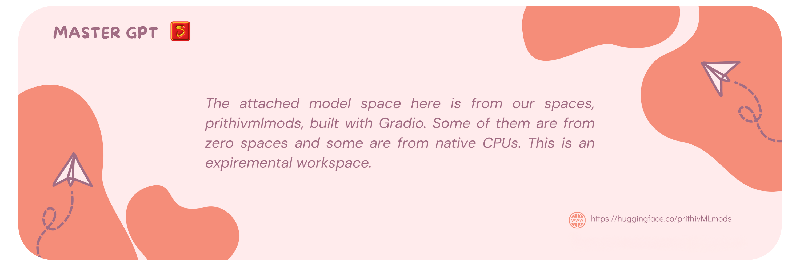

Check out the configuration reference at https://huggingface.co/docs/hub/spaces-config-reference

 
Check out the configuration reference at https://huggingface.co/docs/hub/spaces-config-reference

Spaces: https://huggingface.co/spaces/prithivMLmods/Master-Gpt

To Clone the Repo : 

    # Make sure you have git-lfs installed (https://git-lfs.com)
    git lfs install
    
    git clone https://huggingface.co/spaces/prithivMLmods/Master-Gpt
    
    # If you want to clone without large files - just their pointers
    
    GIT_LFS_SKIP_SMUDGE=1 git clone https://huggingface.co/spaces/prithivMLmods/Master-Gpt

## Sample Screenshots 1

## Sample Screenshots 2

